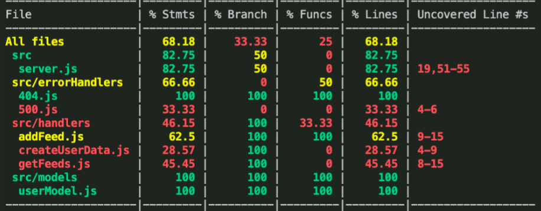

> # RSS-Frontend

## Features

- Authentication: log in with a user-created username and password, or use Auth0
- RSS generation: Submit the URL of an RSS news feed, and links to each news article will generate on the screen
   - The RSS feed that is submitted must be in XML format, although "xml" doesn't need to be in the file/URL name
      - ex: "https://www.huffpost.com/section/front-page/feed?x=1" works successfully, but doesn't explicitly have "xml" in the URL
      - ex: "https://rss.nytimes.com/services/xml/rss/nyt/World.xml" works successfully, and happens to have "xml" in the URL
   - Links are added at the bottom, so scroll down to see more

## Deployment

[Production](https://leafy-lebkuchen-56aff4.netlify.app/)

## Languages and Technologies

- JavaScript
- Node.js
- React
- Express
- MongoDB
- Redux
- Mantine
- Jest
- CORS
- Mongoose
- Supertest
- rss-parser
- Auth0
- Axios
- dotenv
- Netlify
- Heroku

## ENV Setup

- PORT - The port you choose to run locally.
- MONGO_DB_SECRET - The link to your MongoDB
- REACT_APP_AUTHDOMAIN - from Auth0
- REACT_APP_AUTHCLIENTID - from Auth0

## Testing

## Team

- Andrew Schiller
- Marcus Hartwig
- Dylan Ullrich
